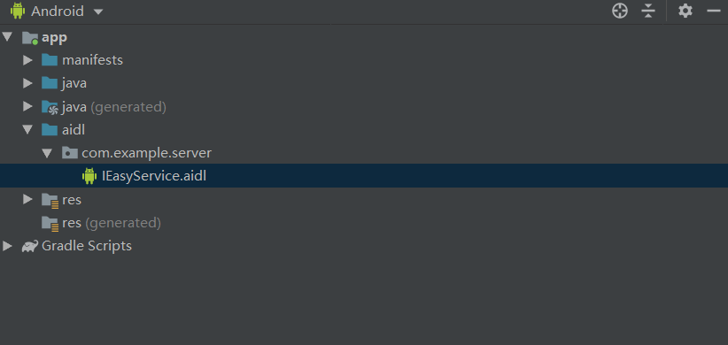

# AidlDemo
#AIDL的简单使用  
Server端：  
  1、创建AIDL文件  
  
  2、在接口中定义方法  
  3、构建Service服务  
  4、在manifest文件中注册服务  
 
 Client端：  
  1、将服务端AIDL文件拷贝到main文件下，包名需要与服务端一致。  
  2、build一下  
  3、连接绑定服务，获取AIDL接口实例  
  4、调用接口  
