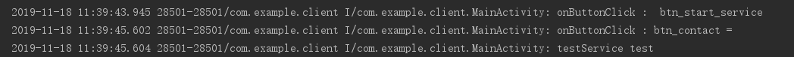

# AidlDemo
## AIDL的简单使用  
### Server端：  
  1、创建AIDL文件  
    
  2、在接口中定义方法  
      
  3、构建Service服务  
    
  4、在manifest文件中注册服务  
    
 
 ### Client端：  
  1、将服务端AIDL文件拷贝到main文件下，包名需要与服务端一致。  
    
  2、build一下  
  3、连接绑定服务，获取AIDL接口实例  
    
  4、调用接口  
    

### 运行结果：  
  

### 使用了JavaBean的情况  
1、创建一个JavaBean实体类，并且继承Parcelable  
  
2、在对应的AIDL包下创建对应实体类的AIDL文件，并且把它改成声明为parcelable数据类型的AIDL文件  
  
3、还是将所有的AIDL文件拷贝的Client端的对应目录下，还是要包名相同  
  
4、注意要将JavaBean文件也拷贝过去  
5、增加了一个新的方法来测试  
  

### 运行结果  
  
